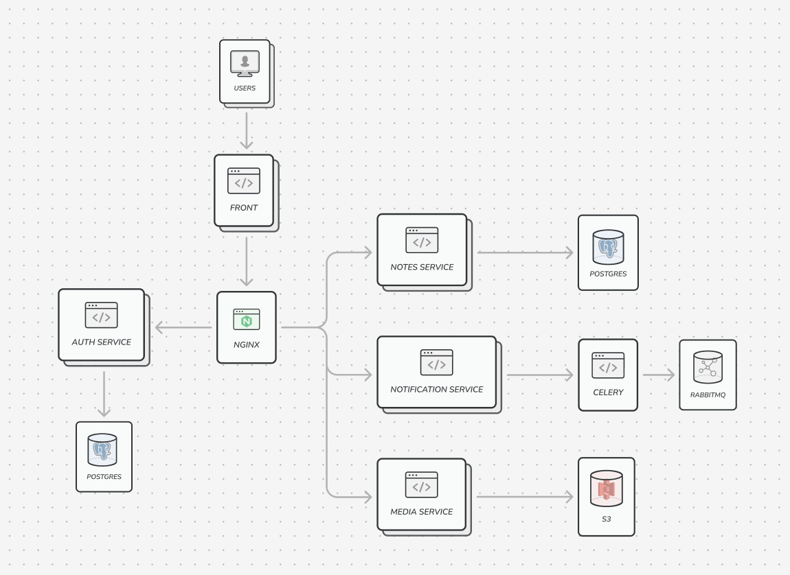

# Custom Notion

## 1. Описание проекта

### 1.1 Идея

Custom Notion — это веб-сервис, который позволяет пользователям создавать и управлять записями в различных формах. Проект включает как фронтенд, так и бэкенд и предоставляет возможность добавления записей с поддержкой медиа и напоминаний.

### 1.2 Функционал

#### 1.2.1 Записи
- Пользователи могут создавать новые записи.
- Записи отображаются в виде файловой системы.
- Содержимое записей - drag-and-drop блоки с текстом или медиа.

#### 1.2.2 Напоминания
- Каждая запись может содержать напоминания.
- Настройка времени и даты напоминаний.
- Напоминания приходят пользователю на почту.

#### 1.2.3 Поддержка медиа
- Возможность добавления изображений к записям.
- Поддержка различных форматов медиа.

### 1.3 Сценарий взаимодействия

1. Пользователь регистрируется в системе. У пользователя сразу есть дефолтная страница.
1. В рабочей области пользователь может редактировать содержимое страниц. (добавлять, удалять и перемещать блоки (текст, медиа))
1. Данные сохраняются в реальном времени.

### 1.4 Концепт UI


## 2. Структура проекта и технологии

### 2.1 Архитектура



Микросервисы. Будет 4 сервиса: Auth (регистрация, авторизация, аутентификация и работа с профиелем), Notes (работа с записями), Notification (работа с напоминаниями), Media (работа с медиа)

Фронт с бэкендом будет общаться через прокси, который будет написан на nginx.

### 2.2 **Фронтенд**

Одна кодовая база. Будет реализован на React для динамики. Antd - интерфейс. Для взаимодействия с API будет использован openapi codegen.

### 2.3 **Бэкенд**

#### 2.3.1 Общее

Весь бэкенд будет написан на python FastAPI.

#### 2.3.2 Auth Service

JWT токены и БД PostgreSQL

#### 2.3.3 Media Service

S3 хранилище

#### 2.3.4 Notification Service

Celery (для работы с фоновыми задачами) и RabbitMQ (брокер сообщений)

#### 2.3.5 Notes Service

БД PostgreSQL.

##### 2.3.5.1 Подробнее про реализацию основной логики записей.

Все сущности - блоки (текст, медиа и даже сами страницы), у всех следующая структура:

```json
{
    "id": "a4cb",
    "type": "to_do",
    "properties": { // <- свойства блока
        "title": [["Title text."]],
        "checked": [["No"]],
    },
    "content": [ // <- дети блока
        "b0c1",
        "be68",
        "3b23",
    ],
    "parent": "405e"
}
```

Такая запись будет соответствовать такому компоненту:

<div style="display: flex; flex-direction: column">
    <div style="display: flex; flex-direction: row">
        <input type="checkbox">Title text.</input>
    </div>
    <div style="display: flex; flex-direction: row">
        &emsp;<input type="checkbox" checked>Child with id: b0c1</input>
    </div>
    <div style="display: flex; flex-direction: row">
        &emsp;<input type="checkbox" checked>Child with id: be68</input>
    </div>
    <div style="display: flex; flex-direction: row">
        &emsp;<input type="checkbox">Child with id: 3b23</input>
    </div>
</div>

Таким образом каждая страница и вообще все записи представляют собой дерево:


Такая структура ОЧЕНЬ гибкая. Она позволяет очень круто манипулировать блоками и связями между ними. Такая концепция сохраняет намерения пользователя относительно организации информации при работе с другой информацией.

Примеры гениальности такой структуры:

###### Отступы

Отступы в данной реализации не просто визуальное изменение, а структурное. Посмотрим, что будет происходить, когда пользователь, редактируя текст, нажмёт на **TAB** для отступа:


Как видим вместо каких-то свойств блока типа "margin" или ещё что-то блок просто меняет родителя с текущего родителя, на соседнего ребёнка.

###### Изменение типа

Так же например если пользователь напишет текст и после захочет сделать этот блок цитатой или checkbox (или обратно) нужно будет только поменять тип блока, никаких properties менять не придётся. (только если добавить поле checked при переходе text -> checkbox, но в обратную сторону менять ничего не придётся)

Таким образом визуальное предствление документа - это всего лишь отражение структуры и информации в ней.

###### Безопасность

Мы поговорили о структуре иинформации, но не поговорили о защите этой информации. Как такая структура защищает информацию?

У каждого пользователя будет мастер блок workspace, к которому у него будет доступ, все осталльные блоки будут наследовать эти права доступа. Чтобы в нашей системе не было неопределённостей и нам было просто перемещаться по дереву для определенния прав доступа будем использовать двусторонние указатели. (родитель ссылается на детей, а ребёнок однозначно ссылается на родителя):


В целом именно так реализована структура данных и в самом notion (подробнее почитать можно тут: https://www.notion.so/blog/data-model-behind-notion)

# 3. Команда

# 3.1 Роли

- **Павел Воронин** : Руководитель, Лид, Архитектор, DevOps, Фронтендер, Дизайнер, Бэкендер, Деплой, Управление разработкой (и на дуде игрец).
- **Георгий Черкасов** : Бэкендер (Auth Service и Notes Service)
- **Ануар Салдан** : Бэкендер (Notification Service и Media Service)

# 3.1 Контакты

tg: @p_voronin 

https://t.me/p_voronin